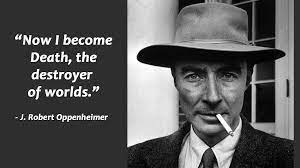

# J. Robert Oppenheimer Tribute Page

## Overview

A tribute page dedicated to J. Robert Oppenheimer, an American theoretical physicist known for his pivotal role in the development of the atomic bomb.

## Biography

Explore the life of J. Robert Oppenheimer, from his birth in 1904 to his impactful contributions and legacy in the field of science. The biography section covers key milestones, academic achievements, and significant events that shaped his remarkable journey.

## Famous Quote

Delve into Oppenheimer's profound quote:

> "I am become Death, the destroyer of worlds."

Accompanied by a compelling image capturing the gravity of the moment, this section provides insight into the emotional and ethical dimensions of Oppenheimer's work.

## Major Topics in His Life

Uncover the major topics that defined Oppenheimer's life, including:

- **Quantum Physics:** Groundbreaking research in energy processes of subatomic particles, neutron stars, and black holes.
  
- **Political Engagement:** Involvement in anti-fascist organizations and support for the republic during the Spanish Civil War.
  
- **Manhattan Project:** Leadership at the Los Alamos Laboratory during World War II, contributing to the development of the atomic bomb.
  
- **Post-War Academic Leadership:** Director of the Institute for Advanced Study, Princeton, contributing to the academic and scientific community.
  
- **Security Hearing:** Faced a security hearing in 1954, leading to the loss of security clearance amid accusations of associations with communists.

## How to Use

To experience the tribute page, simply open the `index.html` file in your preferred web browser. The page is designed to be responsive, ensuring an optimal viewing experience across various devices.

## Contributions

Contributions to enhance or expand the tribute page are welcome. Fork the repository, make your changes, and submit a pull request. Bug reports and feature requests can be submitted via GitHub issues.

## License

This project is licensed under the [MIT License](LICENSE).

## Author

Written and coded by Subzero.

Feel free to explore and contribute to the tribute page, honoring the life and legacy of J. Robert Oppenheimer.
